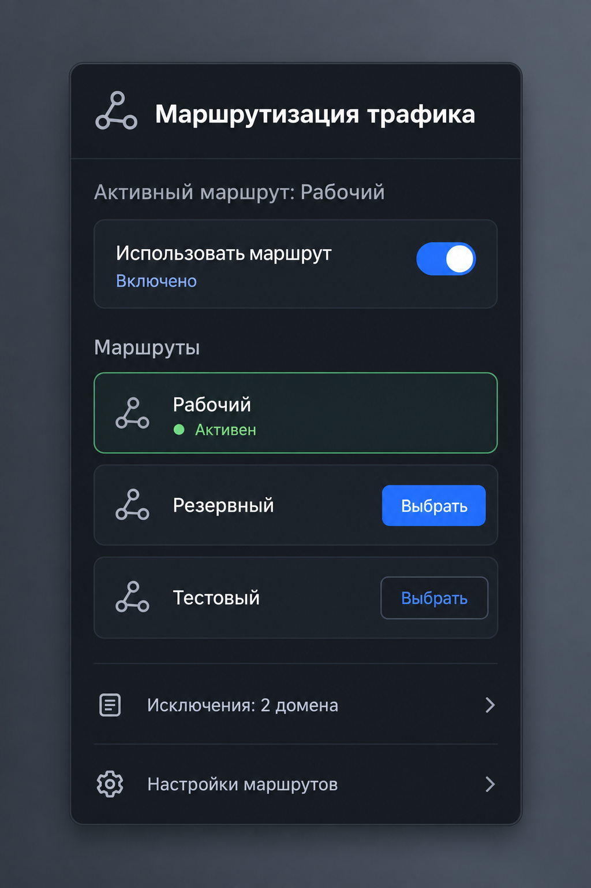

# Chrome Proxy Extension

Technical Chrome extension for selecting a named network route
(SOCKS5/HTTP/HTTPS) and defining domains that must bypass it.

## Interface



The mockup uses fictional route names. It illustrates choosing an active route
and maintaining a list of domains that connect directly.

## Features
- Add, edit and remove named network routes.
- Select the active route in the popup or disable routing with a dedicated toggle.
- Store route definitions in sync storage.
- Define direct-access exceptions; with no exceptions, the selected route handles all traffic.
- Add or remove the current domain from exclusions through the action context menu.

## How It Works
- The background service worker reads the selected route and applies it through
  `chrome.proxy.settings`.
- Excluded domains are stored in `chrome.storage.local` and used to build a PAC script.
  These domains connect directly; the selected route handles all other traffic.
- The options page manages route definitions and exclusions.

## Setup
1. Open Chrome and go to `chrome://extensions`.
2. Enable **Developer mode**.
3. Click **Load unpacked** and select the `src` folder.
4. Open the extension **Options** page and add one or more named routes.
5. Click the extension icon and choose a route from the list.

## Proxy URL Format
```
scheme://host:port
```
Supported schemes: `socks5`, `socks5h`, `http`, `https`.

Example:
```
socks5://127.0.0.1:1080
```

## Project Files
- `src/background.js` — service worker: proxy toggle and context menu.
- `src/options.html` / `src/options.js` — server and domain management.
- `src/popup.html` / `src/popup.js` — active server selection.
- `src/manifest.json` — Chrome extension manifest.

## License
MIT. See `LICENSE`.
